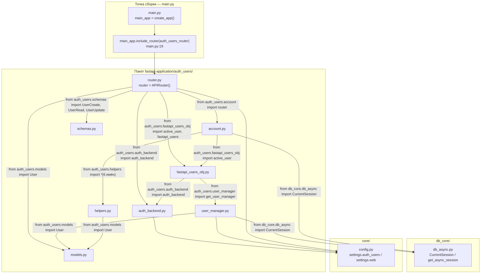
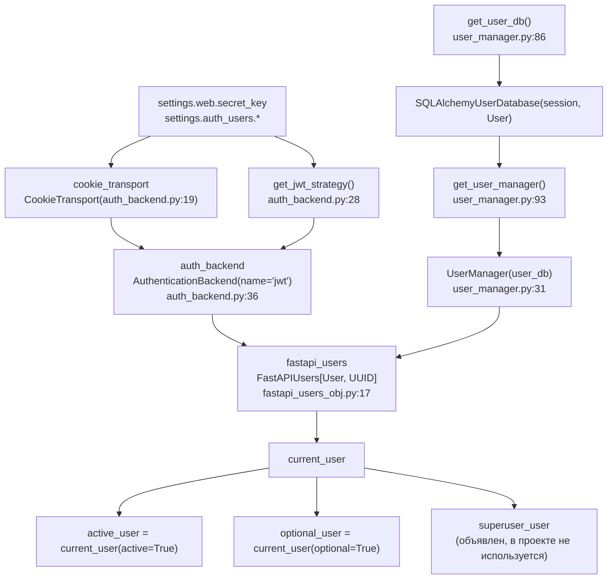
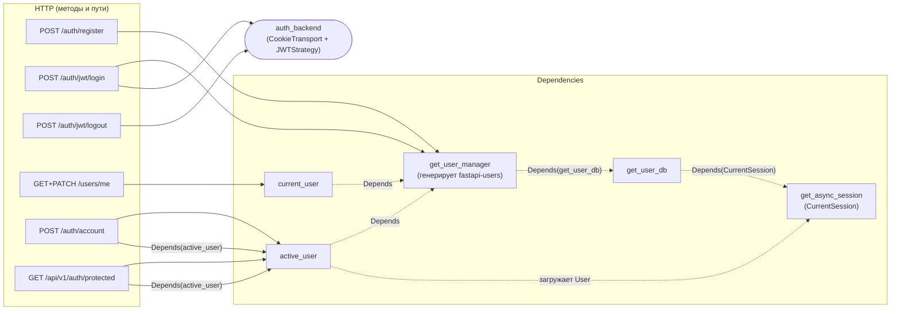
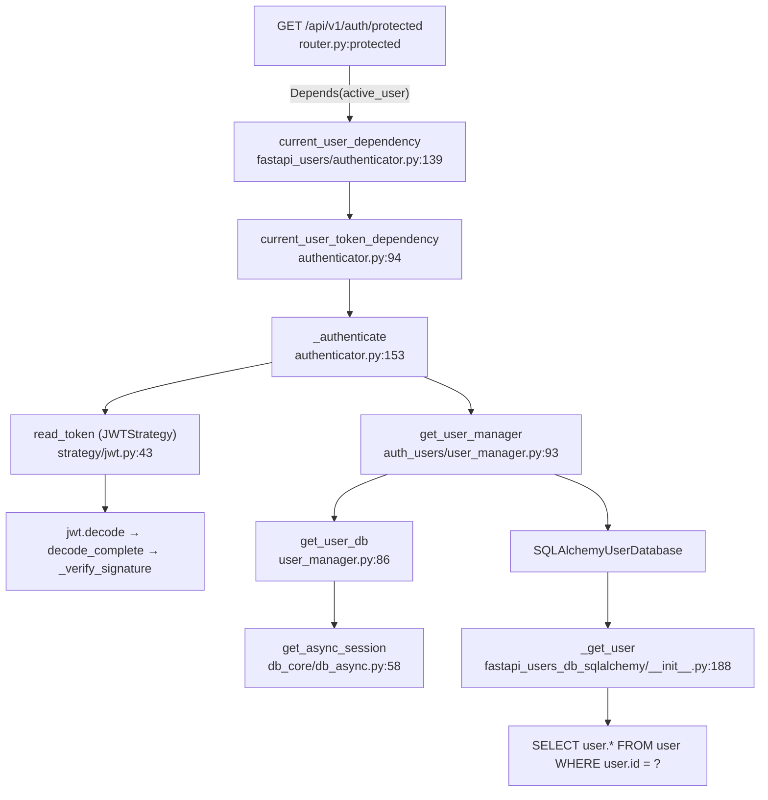
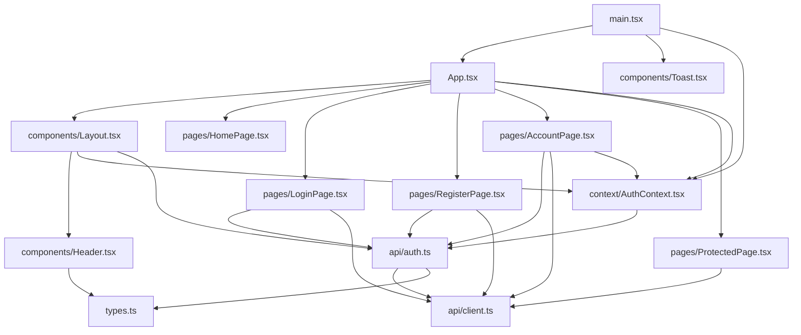
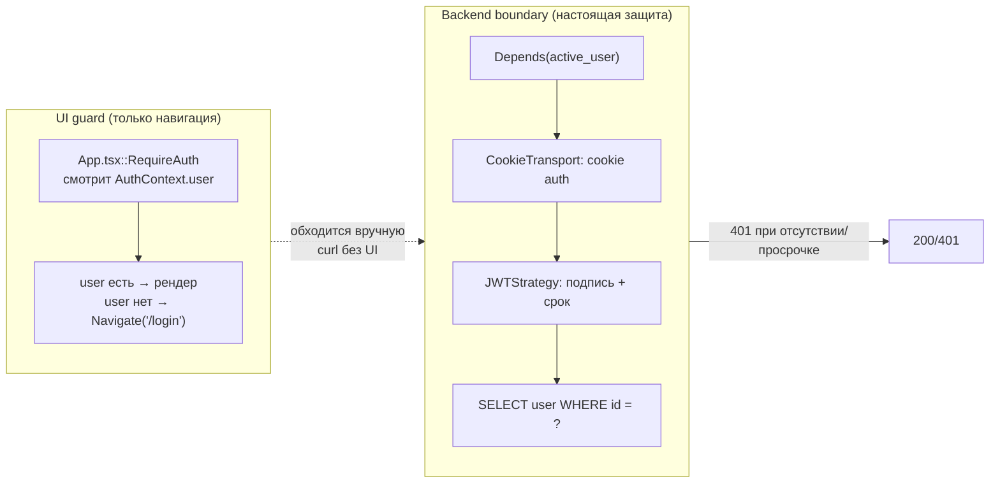

# 06. Авторизация: диаграммы связей и рантайм-граф вызовов

Дополнение к [`docs/04_authorization.md`](04_authorization.md). Тот документ описывает
авторизацию текстом-потоком; здесь те же связи показаны **диаграммами** и — отдельно —
**фактическим графом вызовов**, снятым профилировщиком на живом приложении.

Ключевая мысль, которую невозможно увидеть в тексте: в этом проекте авторизация держится
на **`Depends(...)`**, а `Depends` — это не вызов функции. Поэтому ни статический анализ,
ни граф кодовой базы (`codebase-memory-mcp`) не показывают связи `protected → active_user`:
для статики `active_user` просто значение аргумента по умолчанию. Ниже эти связи
нарисованы вручную (по коду) и подтверждены рантайм-профилем.

Источник данных: прогон полного цикла (register → login → `/users/me` → `/auth/account` →
`/api/v1/auth/protected` → logout) через `TestClient` под `cProfile`. Сырые данные —
в разделе 7.

---

## 1. Слои и точка сборки



Все импорты — **плоские** (`core.config`, `db_core.db_async`, а не путь от корня
репозитория): приложение запускается с cwd = `fastapi-application/`, где эти модули лежат
в корне `sys.path`.

---

## 2. Экземпляры: кто что собирает

Этот граф — про объекты, а не про файлы. `fastapi_users_obj.py` — единственное место,
где собирается связка «менеджер + бэкенд», и именно от него наследуются все
`Depends`-обёртки.



Версии, на которых это собрано: `fastapi 0.141.1`, `fastapi-users 15.0.5`,
`fastapi-users-db-sqlalchemy 7.0.0`, `starlette 1.6.0`, `pydantic 2.13.5`,
`sqlalchemy 2.0.52`, `pwdlib 0.3.0` (Argon2), `pyjwt 2.14.0`.

---

## 3. Маршруты и их зависимости

Слева — HTTP, справа — что реально инжектится. Стрелки `--o` показывают **DI-связи,
невидимые статике**: `Depends(active_user)`, `Depends(get_user_manager)`,
`Depends(get_user_db)`, `Depends(get_async_session)`.



Три маршрута — `/auth/jwt/login`, `/auth/jwt/logout`, `/auth/register` — **не имеют
своих обработчиков в этом репозитории**. Их создаёт `fastapi-users` в момент импорта:

```python
# auth_users/router.py
auth_router = fastapi_users.get_auth_router(auth_backend)          # :26
register_router = fastapi_users.get_register_router(UserRead, UserCreate)   # :27
users_router = fastapi_users.get_users_router(UserRead, UserUpdate)         # :28
users_router.routes = [rt for rt in users_router.routes if rt.path == "/me"]  # :29
```

Строка `:29` — важная: `get_users_router` порождает пять путей (`/me` GET/PATCH,
`/{id}` GET/PATCH/DELETE), и проект **обрезает список до `/me`**. Поэтому маршрутов
управления пользователями по ID в приложении нет, хотя библиотека их предлагает.

Инвентаризация живого приложения (рекурсивный обход `main_app.routes`) — 44 объекта,
из них 37 `APIRoute`:

```
/openapi.json                                     ['GET','HEAD']  <- openapi
/docs                                             ['GET','HEAD']  <- swagger_ui_html
/docs/oauth2-redirect                             ['GET','HEAD']  <- swagger_ui_redirect
/redoc                                            ['GET','HEAD']  <- redoc_html
/api/v1/dep_examples/single-direct-dependency     ['GET']
/api/v1/dep_examples/single-via-func              ['GET']
/api/v1/dep_examples/multi-direct-and-via-func    ['GET']
/api/v1/dep_examples/multi-indirect               ['GET']
/api/v1/dep_examples/helper-as-dependency         ['GET']
/api/v1/dep_examples/great-service-as-dependency  ['GET']
/api/v1/dep_examples/direct-cls-dependency        ['GET']
/api/v1/fastapi_class_old/my_items/{item_id}      ['GET']
/api/v1/fastapi_class_annotated/my_items/{item_id} ['GET']
/api/v1/depends_class_annotated/my_items/{item_id} ['GET']
/api/v1/depends_function_annotated/my_items/{item_id} ['GET']
/orders/add_order                                 ['POST']
/orders/insert_order                              ['POST']
/orders/get_order_filter_by                       ['GET']
/orders/get_order_where                           ['GET']
/orders/get_all_orders                            ['GET']
/orders/get_all_join                              ['GET']
/auth/jwt/login                                   ['POST']  <- auth:jwt.login
/auth/jwt/logout                                  ['POST']  <- auth:jwt.logout
/auth/register                                    ['POST']  <- register:register
/users/me                                         ['GET']   <- users:current_user
/users/me                                         ['PATCH'] <- users:patch_current_user
/auth/account                                     ['POST']  <- auth.account_post
/api/v1/auth/protected                            ['GET']   <- protected
/assets                                           []        <- Mount spa_assets
/{full_path:path}                                 ['GET','HEAD'] <- spa_fallback
```

Примечание: в FastAPI 0.141 `include_router` кладёт в `app.routes` объект
`_IncludedRouter` (с полем `include_context`), а не плоский список `APIRoute`. Наивный
обход `len(main_app.routes)` даёт **9** — это длина верхнего уровня, а не число
маршрутов. Считать нужно рекурсивно, разворачивая `include_context.prefix`.

---

## 4. Поток login (по коду, со ссылками)

```mermaid
sequenceDiagram
    autonumber
    participant B as Браузер
    participant C as api/client.ts
    participant A as api/auth.ts
    participant L as LoginPage.tsx
    participant R as fastapi_users/router/auth.py
    participant UM as fastapi_users/manager.py
    participant PL as pwdlib (Argon2)
    participant JWT as JWTStrategy (PyJWT)
    participant CT as CookieTransport
    participant LS as login-steps

    B->>L: submit(email, password)
    L->>A: login({email, password})
    A->>C: postForm('/auth/jwt/login', username=email)
    C->>R: POST (x-www-form-urlencoded, credentials:include)
    R->>UM: authenticate(credentials, user_manager)
    UM->>PL: verify_and_update(password, hashed_password)
    PL-->>UM: ok
    UM-->>R: User
    R->>JWT: write_token(user)
    JWT-->>R: подписанный JWT (HS256)
    R->>CT: Set-Cookie auth=JWT; HttpOnly; Max-Age=86400
    R-->>C: 204 No Content
    C-->>A: ok
    A->>A: затем GET /users/me (второй запрос)
```

Практическое следствие (важное при отладке): **логин — всегда два запроса**. `204` не
несёт тела, поэтому `api/auth.ts::login()`:

```ts
// frontend/src/api/auth.ts:17
return postForm<unknown>('/auth/jwt/login', form).then(() => getJson<User>('/users/me'));
```

Это подтверждено профилем: `read_token` вызывался 20 раз за прогон при 5 логинах —
на каждый защищённый запрос браузер шлёт cookie заново, и JWT декодируется заново.

---

## 5. Рантайм-граф вызовов (фактические данные `cProfile`)

Тот же сценарий, но снятый профайлером. Здесь видно то, чего нет ни в одном документе:
какой **реальный** код выполняется после `Depends(active_user)` и
`fastapi_users.get_auth_router()`.

### 5.1. Кто вызывает код проекта

| вызывающий (библиотека) | → | функция проекта | файл:строка |
|---|---|---|---|
| `fastapi_users/router/register.py:16` | → | `UserManager.create` | `auth_users/user_manager.py:50` |
| `fastapi_users/manager.py:110` | → | `UserManager.validate_password` | `auth_users/user_manager.py:42` |
| `fastapi_users/manager.py:110` | → | `UserManager.on_after_register` | `auth_users/user_manager.py:71` |
| `fastapi/routing.py:344` (`run_endpoint_function`) | → | `account_post` | `auth_users/account.py:30` |
| `fastapi/routing.py:344` (`run_endpoint_function`) | → | `protected` | `auth_users/router.py:34` |
| `contextlib.__aenter__/__aexit__` | → | `get_user_manager` | `auth_users/user_manager.py:93` |
| `contextlib.__aenter__/__aexit__` | → | `get_user_db` | `auth_users/user_manager.py:86` |
| `contextlib.__aenter__/__aexit__` | → | `get_async_session` | `db_core/db_async.py:58` |
| `fastapi/routing.py:1778` (`handle`) | → | `validation_response` | `auth_users/helpers.py:46` |
| `_contextvars.Context.run` | → | `get_jwt_strategy` | `auth_users/auth_backend.py:28` |

Обратите внимание на строку `contextlib.__aenter__` → `get_user_manager`: **dependency
в этом проекте — асинхронный генератор**, его вход в тело и выход из него идут через
`__aenter__`/`__aexit__`. Именно поэтому `get_user_manager` в профиле имеет 14 вызовов
(7 входов + 7 выходов), а не 7.

### 5.2. Что вызывается внутри кода проекта (и во что упирается)

| функция проекта | ncalls | cum, с | уходит в |
|---|---:|---:|---|
| `UserManager.create` (`user_manager.py:50`) | 23 | 0.0197 | `fastapi_users/manager.py:create` (0.0161) |
| `on_after_register` (`user_manager.py:71`) | 10 | 0.0067 | `SQLAlchemyUserDatabase.update`, `str.split` |
| `get_user_manager` (`user_manager.py:93`) | 14 | 0.0047 | `logging.debug` (130 вызовов, 0.0041 с) |
| `get_async_session` (`db_core/db_async.py:58`) | 21 | 0.0017 | `AsyncSession.__aenter__/__aexit__` |
| `account_post` (`account.py:30`) | 5 | 0.0011 | `is_valid_email`, `username_exists` |
| `username_exists` (`helpers.py:27`) | 5 | 0.0006 | `AsyncSession.execute` → SELECT по `username` |
| `protected` (`router.py:34`) | 1 | 0.0006 | `UserRead.model_validate` (pydantic) |
| `is_valid_email` (`helpers.py:19`) | 1 | 0.0005 | `EmailStr._validate` (pydantic/networks) |
| `get_jwt_strategy` (`auth_backend.py:28`) | 6 | 0.0001 | `JWTStrategy.__init__` |
| `validation_response` (`helpers.py:46`) | 1 | 0.0001 | `JSONResponse.__init__` |
| `get_user_db` (`user_manager.py:86`) | 14 | ~0 | `SQLAlchemyUserDatabase.__init__` |
| `validate_password` (`user_manager.py:42`) | 1 | ~0 | `len` |
| `models.py:38 <lambda>` | 1 | ~0 | `datetime.now` (дефолт `created_at`) |

### 5.3. Ответ на исходный вопрос: цепочка `Depends(active_user)`

Это то, ради чего стоит читать документ. Ни `active_user`, ни `protected` не имеют
статических связей — вот их **фактическая** цепочка из профиля:



Цифры из прогона: `_authenticate` — 21 вызов, `read_token` — 20, `current_user_dependency`
— 16, `_get_user` (SQLAlchemy-адаптер) — 30. `get_user_manager` / `get_user_db` /
`get_async_session` пересоздаются на **каждый** защищённый запрос — это и есть та самая
магия, которая в статике не видна. Кэширования `get_user_manager` нет.

### 5.4. Цепочка login по профилю (факт, не замысел)

```
login (fastapi_users/router/auth.py:44, cum 0.3367 с, 5 вызовов)
 └─ authenticate (fastapi_users/manager.py:636, cum 0.3347)
     └─ verify_and_update (fastapi_users/password.py:31, cum 0.3310)
         └─ pwdlib/_hash.py:87  →  pwdlib/hashers/argon2.py:‎verify (0.3274)
                                    →  argon2/_password_hasher.py:215
```

**98.5% времени логина — это Argon2.** `0.3274` из `0.3367` секунды. Всё остальное
(`read_token`, `decode` JWT, SQL) — доли миллисекунд:

```
read_token (strategy/jwt.py:43)     0.0073  (20 вызовов)
jwt decode → _verify_signature      0.0018  ( 4 вызова)
write_token (strategy/jwt.py:65)    0.0004  ( 1 вызов)
```

Практический вывод: если логин «медленный» — это не JWT и не БД, это стоимость хеша
пароля. Так и должно быть; оптимизировать там нечего.

---

## 6. Фронтенд: статический граф импортов

Здесь статический анализ (и `codebase-memory-mcp`) работает хорошо — TS-связи видны.
Импорты фронтенда, относящиеся к авторизации:



Вызовы внутри фронтенда (`trace_path`, подтверждено графом):

| функция | вызывает | вызывается из |
|---|---|---|
| `api/auth.ts::login` | `postForm`, `getJson`, `request`, `ensureOk` | `LoginPage::handleSubmit` |
| `api/auth.ts::logout` | `postForm`, `request` | `Layout::handleLogout` |
| `AuthContext::AuthProvider` | `api/auth.ts::getCurrentUser` | `main.tsx` (монтирование) |
| `Layout::handleLogout` | `api/auth.ts::logout` | `Header` (кнопка «Выход») |

Два уровня защиты — их важно не путать (это прямо названо в `docs/04_authorization.md`,
но диаграммой виднее):



`RequireAuth` **не защищает API** — он только улучшает навигацию. Пользователь может
отправить запрос без UI; окончательный контроль — `Depends(active_user)` на бэкенде.

---

## 7. Методика и сырые доказательства

### Что и как снималось

- Скрипт: `/tmp/auth_profile_run.py` (в репозиторий не входит).
- Сценарий: `register` → `login` → `GET /users/me` → `POST /auth/account` →
  `GET /api/v1/auth/protected` → `logout` → повторный `protected`.
- Прогрев выполнялся до включения профайлера, чтобы в граф не попали создание схем,
  шаблонов и первые SQL-подготовки.
- Профайлер: `cProfile` + `pstats`, `TestClient` из `fastapi.testclient`.

Фактический ход прогона:

```
register: 201
login: 204 set-cookie: True
me: 200
account: 422          # username 'profuser' уже занят прошлым прогоном — ожидаемо
protected: 200
logout: 204
protected after logout: 401
```

`402 → 401` после logout — ключевое подтверждение: cookie удалена, `active_user`
больше не находит токен.

### Ограничения замеров

- Цифры `cProfile` **искажены overhead-ом** профайлера и `TestClient` (нет сети, нет
  реального ASGI-сервера). Соотношения (например «Argon2 — почти всё время логина»)
  достоверны, абсолютные миллисекунды — нет.
- `account: 422` в прогоне — из-за занятого username, а не баг. Ветка «успешное
  обновление» профилем не покрыта.
- В профиль попал только один процесс, работающий с SQLite. Поведение на PostgreSQL
  (asyncpg) по числу вызовов совпадёт, по времени — нет.
- Фронтенд профилем не покрыт вообще: его граф (раздел 6) — статический, из импортов.

### Воспроизведение

```bash
cd fastapi-application
../.venv/bin/python /tmp/auth_profile_run.py      # пишет /tmp/auth_profile.txt + /tmp/auth_web_raw.prof
```

Просмотр профиля:

```bash
.venv/bin/python -c "
import pstats
pstats.Stats('/tmp/auth_web_raw.prof').sort_stats('cumulative').print_stats(60)
"
```

### Замечание по инструментам профилирования

`py-spy` (сэмплирующий, внешний процесс — точнее по реальному рантайму) в системе не
установлен; `httpx`, который требовал `TestClient`, заменён на `httpx2` (в проекте
`starlette 1.6.0` требует именно `httpx2`). Для снятия графа с **реально запущенного
uvicorn** (а не `TestClient`) понадобится `py-spy record --pid <PID> -o profile.svg` —
это внешний инструмент, в `.venv` его нет.

### Что показал граф кодовой базы (`codebase-memory-mcp`)

Индекс проекта: 951 узел, 2218 связей, статус `ready`. По авторизации граф даёт:

- **Хорошо:** файлы пакета и `IMPORTS`/`USAGE` — `router.py → {account, auth_backend,
  fastapi_users_obj, schemas, models}`, `account_post → active_user`, `get_user_manager →
  {get_user_db, UserManager}`. Найдено 20 связей в пакете.
- **Плохо (ожидаемо):** `trace_path('active_user')` и `trace_path('protected')` возвращают
  **пусто** в обе стороны — DI-связи через `Depends` граф не видит.
- **Плохо:** фронтенд-граф (48 `IMPORTS`) заметно полнее бэкендового, потому что в TS
  связь — это настоящий импорт и вызов, а в Python-роутере связь спрятана в аргументе
  по умолчанию.

---

## 8. Шпаргалка: «где искать, когда что-то не работает»

| Симптом | Куда смотреть | Почему |
|---|---|---|
| Логин не ставит cookie | `auth_backend.py:19` `cookie_transport`, `core/config.py::AuthUsersConfig` | имя/атрибуты cookie (`auth`, HttpOnly, SameSite) |
| `401` на защищённом запросе | `fastapi_users/authentication/authenticator.py:153` (`_authenticate`) → `strategy/jwt.py:43` (`read_token`) | цепочка проверки cookie/JWT |
| Появилось «лишнее» `Depends` | `fastapi_users_obj.py:17–22` | все обёртки (`current_user`, `active_user`, …) — из одного `fastapi_users` |
| Маршрут `/users/{id}` пропал | `router.py:29` | список обрезается до `/me` |
| Регистрация падает `500` на дубликате | `user_manager.py:50` (`UserManager.create`) | перехват `IntegrityError → UserAlreadyExists` |
| Регистрация не заполняет `username` | `user_manager.py:71` (`on_after_register`) | вывод username из email |
| Логин медленный | `pwdlib/hashers/argon2.py` | 98% времени login — Argon2 |
| `422` на `/auth/account` | `helpers.py:19,27,33,46` + `account.py:30` | валидация email/уникальности |

---

## 9. Профиль живого сервера: py-spy flame graph

`cProfile` из раздела 5 шёл через `TestClient` — без сети, без ASGI-стека, с сильным
overhead. Чтобы увидеть настоящий сервер, снят **py-spy** (сэмплирующий профилировщик,
подключается извне, не правит процесс).

### Как снималось

```bash
# 1. сервер запускается САМОЙ py-spy (в этой среде ptrace_scope=1, иначе Permission Denied)
py-spy record --rate 250 --format flamegraph --output docs/06_auth_flamegraph.svg \
    -- .venv/bin/uvicorn main:main_app --host 127.0.0.1 --port 8013

# 2. параллельно — непрерывная нагрузка полным циклом авторизации (60 с)
#    register -> login -> /users/me -> /protected -> logout
```

Нагрузка за прогон: **134 полных цикла**, все коды чистые —
`register=201, login=204, me=200, protected=200, logout=204`.

Результат профиля: **16 078 сэмплов, 4 ошибки** (0.02%), `py-spy 0.4.2`.

### Артефакты

- `docs/06_auth_flamegraph.svg` — интерактивный flame graph (наведение → фрейм + сэмплы)
- `docs/06_auth_flamegraph.png` — растровая версия (2200 px)

### Что видно на графе

| Доля | Фрейм | Что это |
|---|---|---|
| 49.5% | `aiosqlite/core.py:59 _connection_worker_thread` | поток БД — `cProfile` его не показывает вовсе |
| 46.7% | `uvicorn/main.py:490 main` | главный поток целиком |
| 28.5% | `httptools_impl.py:422 run_asgi` → ASGI-стек Starlette/FastAPI | обработка HTTP-запроса |
| 27.9% | `fastapi/routing.py` (`handle`/`_handle_selected`) | роутинг + разрешение DI |
| **11.9%** | `register → UserManager.create → pwdlib.hash → argon2.hash_secret` | **хеш пароля при регистрации** |
| **11.5%** | `login → authenticate → verify_and_update → pwdlib.verify → argon2.verify_secret` | **проверка пароля при логине** |
| 7.4% | `<module> auth_users/auth_backend.py:13` | импорт при старте, разово — не на запрос |

Главный вывод совпал с `cProfile`, но уже на реальном сервере: **внутри главного потока
Argon2 — примерно половина времени**. Всё остальное (JWT, SQL, ASGI) — доли процента.

### Два факта, которых не дал `cProfile`

1. **`aiosqlite` держит отдельный поток.** В `cProfile` вызовы БД выглядели как
   синхронные `execute`; на flame graph видно, что ~49% сэмплов процесса — это
   `Thread-1 (_connection_worker_thread)`, куда aiosqlite уводит работу с SQLite.
   Значит профиль БД нельзя читать по главному потоку.
2. **Видно нативное время библиотек.** `cProfile` показывает `argon2/_password_hasher.py`
   как функцию со временем, но не говорит, сколько внутри C-кода; flame graph
   показывает `hash_secret`/`verify_secret` (`argon2/low_level.py`) отдельными кадрами.

### Ограничения

- 4 сэмпла не разрешились (`Errors: 4`) — на доли процента не влияет.
- Один из «широких» кадров — импорт при старте (`auth_backend.py:13`, 7.4%);
  при более длительной нагрузке он размывается и к запросам отношения не имеет.
- `py-spy top --pid` в этой среде требует ptrace и падает с `Permission Denied`;
  работает только схема «py-spy сам запускает процесс».
- Воспроизведение: `py-spy` — внешний инструмент (`uv tool install py-spy`),
  в `.venv` и в `pyproject.toml` его нет.
