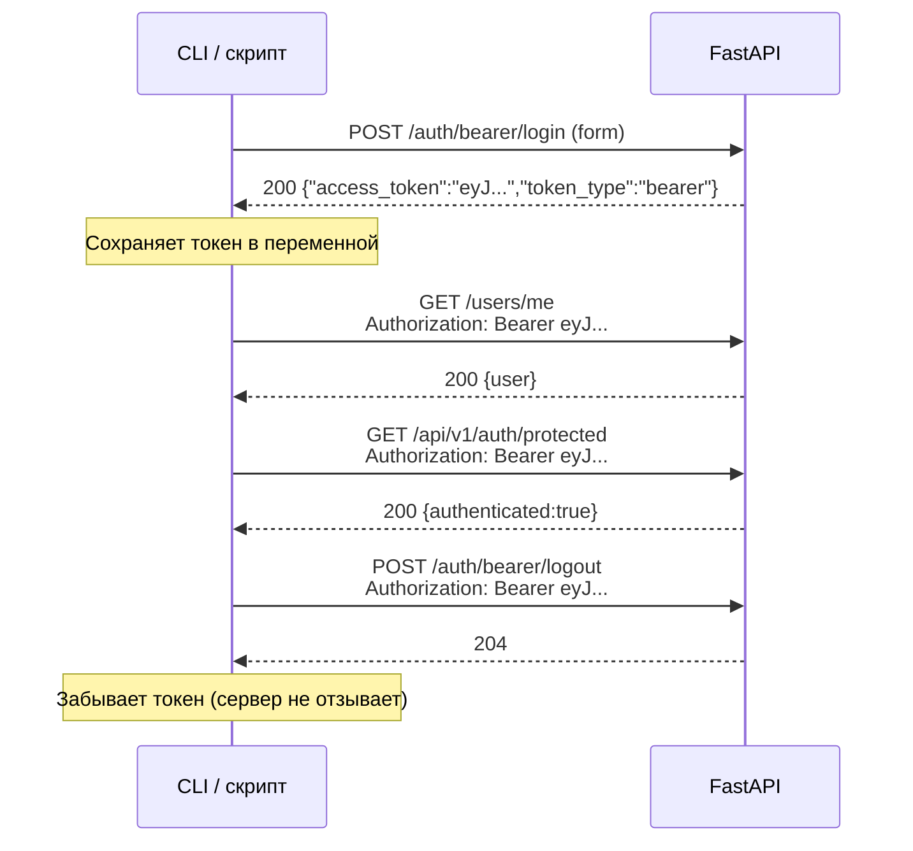

# Два транспорта авторизации: живой разбор cookie и Bearer потоков

> Учебный walkthrough по реальному коду `temp-auth-react-fast`. Не сухая справка, а
> разговор о том, как устроены два способа аутентификации в одном приложении, почему
> cookie-поток требует CSRF, а Bearer — обычно нет, и что происходит, когда клиент
> присылает и cookie, и `Authorization` одновременно. Все фрагменты кода взяты из
> текущей реализации; внешние утверждения проверены через Tavily 2026-10-03.

## Какую задачу решаем

В проекте сосуществуют два типа клиентов:

- **Браузер (React SPA).** Хочет «просто работать»: пользователь залогинился один раз,
  дальше браузер сам носит учётные данные в cookie, фронтенд не хранит токены в памяти
  или localStorage. Но cookie автоматически подставляются в любой запрос к тому же
  домену — это открывает дверь для CSRF.
- **Не-браузерный клиент (CLI, мобильное приложение, server-to-server).** Не умеет или
  не хочет работать с cookie; предпочитает получить токен в JSON и явно подставлять его
  в заголовок `Authorization: Bearer <token>` ([RFC 6750](https://www.rfc-editor.org/rfc/rfc6750)).
  CSRF здесь не при чём, потому что токен не передаётся браузером автоматически.

Задача бэкенда — обслуживать оба потока на **одной и той же** JWT-стратегии (один
секрет, один формат payload, одно время жизни), но разными транспортами. Задача
фронтенда — для cookie-потока зеркалить CSRF-токен в заголовок, а для bearer-потока
(если он когда-нибудь понадобится в SPA) просто ставить `Authorization`.

---

## Сравнение транспортов: что где живёт

| Аспект | CookieTransport (`jwt-cookie`) | BearerTransport (`jwt-bearer`) |
|---|---|---|
| Куда кладётся JWT | `Set-Cookie: auth=...` (HttpOnly) | Тело ответа `{"access_token": "...", "token_type": "bearer"}` |
| Как клиент передаёт JWT дальше | Браузер автоматически в `Cookie:` | Клиент явно ставит `Authorization: Bearer ...` |
| Нужен ли CSRF | Да, для state-changing запросов | Нет (если нет auth-cookie в том же запросе) |
| Кто управляет lifecycle | Сервер: `Set-Cookie` / `delete_cookie` | Клиент: сохраняет/забывает токен сам |
| Типичный потребитель | React SPA в этом проекте | curl / Postman / мобильные / s2s |
| Endpoint login | `POST /auth/cookie/login` (form, 204) | `POST /auth/bearer/login` (form, 200 + JSON) |
| Endpoint logout | `POST /auth/cookie/logout` (form, 204) | `POST /auth/bearer/logout` (204, stateless) |

Оба backend'а определены в `fastapi-application/auth_users/auth_backend.py` и используют
**одну функцию** `get_jwt_strategy()` — поэтому JWT внутри одинаковый, отличается только
способ доставки и извлечения.

```python
# fastapi-application/auth_users/auth_backend.py
cookie_backend = AuthenticationBackend(
    name="jwt-cookie",
    transport=cookie_transport,
    get_strategy=get_jwt_strategy,
)

bearer_backend = AuthenticationBackend(
    name="jwt-bearer",
    transport=bearer_transport,
    get_strategy=get_jwt_strategy,
)
```

Порядок регистрации важен: в `fastapi_users_obj.py` authenticator перебирает backend'ы
слева направо, сначала пытаясь извлечь пользователя из cookie, потом из Bearer-заголовка:

```python
# fastapi-application/auth_users/fastapi_users_obj.py
fastapi_users = FastAPIUsers[User, UUID](
    get_user_manager, [cookie_backend, bearer_backend]
)
active_user = fastapi_users.current_user(active=True)
```

---

## Почему cookie требует CSRF, а Bearer — обычно нет

### Природа угрозы

CSRF (Cross-Site Request Forgery) работает так: злонамеренный сайт заставляет браузер
жертвы отправить запрос к вашему API, и браузер **автоматически** подставляет все cookie
для этого домена ([RFC 6265](https://www.rfc-editor.org/rfc/rfc6265)). Если сервер доверяет
cookie без дополнительной проверки, действие выполняется от имени жертвы. OWASP рекомендует
Signed Double Submit Cookie как один из надёжных паттернов: сервер выдаёт подписанный
токен в cookie, клиент зеркалит его в заголовке, сервер сравнивает оба значения и
проверяет подпись ([OWASP CSRF Cheat Sheet](https://cheatsheetseries.owasp.org/cheatsheets/Cross-Site_Request_Forgery_Prevention_Cheat_Sheet.html)).

Bearer-токен в заголовке `Authorization` браузер автоматически не подставляет. Злоумышленник
не может заставить чужой браузер отправить `Authorization: Bearer <token>`, потому что
JS на чужом сайте не знает этот токен (если вы сами не утекли его через XSS). Поэтому
для чистого Bearer-потока CSRF-защита избыточна.

### Caveat: смешанный Cookie + Bearer

Если клиент прислал **и** auth-cookie, **и** `Authorization: Bearer ...`, наш middleware
всё равно требует `X-CSRF-Token`. Это намеренно: иначе наличие Bearer-заголовка стало бы
обходом cookie-защиты. Правило в `csrf.py::_requires_check`:

```python
# fastapi-application/auth_users/csrf.py
def _requires_check(self, request: Request) -> bool:
    return (
        request.method in STATE_CHANGING_METHODS
        and self.auth_cookie_name in request.cookies
    )
```

Наличие `Authorization` не проверяется и не освобождает от CSRF. Если auth-cookie
присутствует — проверка обязательна, независимо от других заголовков.

---

## Browser flow: cookie-поток от и до

### Sequence diagram

```mermaid
sequenceDiagram
    participant U as Пользователь
    participant SPA as React SPA
    participant API as FastAPI
    participant MW as CSRFMiddleware

    U->>SPA: Вводит email/password
    SPA->>API: POST /auth/cookie/login (form, credentials:include)
    API-->>SPA: 204 + Set-Cookie: auth=JWT; HttpOnly
    MW-->>SPA: Set-Cookie: csrf_token=nonce.sig (non-HttpOnly)
    Note over SPA: Читает csrf_token из document.cookie

    SPA->>API: GET /users/me (credentials:include)
    API-->>SPA: 200 {user}

    SPA->>API: POST /api/v1/auth/protected<br/>X-CSRF-Token: nonce.sig
    MW->>MW: _requires_check=true,<br/>сравнивает cookie и header
    MW-->>API: пропуск
    API-->>SPA: 200 {authenticated:true}

    SPA->>API: POST /auth/cookie/logout<br/>X-CSRF-Token: nonce.sig
    MW-->>API: пропуск
    API-->>SPA: 204
    MW-->>SPA: delete_cookie(csrf_token)
    Note over SPA: auth-cookie удалена сервером,<br/>csrf_token удалена
```

### Что происходит в коде

**1. Login.** `LoginPage` вызывает `login()` из `frontend/src/api/auth.ts`:

```typescript
// frontend/src/api/auth.ts
export function login(body: { email: string; password: string }): Promise<User> {
    const form = new URLSearchParams({
        username: body.email,   // fastapi-users ожидает поле username
        password: body.password,
    });
    return postForm<unknown>('/auth/cookie/login', form)
        .then(() => getJson<User>('/users/me'));
}
```

`postForm` идёт через `client.ts`, который всегда ставит `credentials: 'include'`
([MDN Fetch: Using Fetch](https://developer.mozilla.org/en-US/docs/Web/API/Fetch_API/Using_Fetch))
и добавляет `X-CSRF-Token`, если cookie `csrf_token` существует:

```typescript
// frontend/src/api/client.ts
async function request(path: string, init: RequestInit = {}): Promise<Response> {
    const res = await fetch(path, { credentials: 'include', ...init });
    return res;
}

function withCsrfHeader(headers: Record<string, string>): Record<string, string> {
    const csrfToken = getCsrfToken();
    if (!csrfToken) return headers;
    return { ...headers, 'X-CSRF-Token': csrfToken };
}
```

На login CSRF-заголовок **не нужен**: в этот момент auth-cookie ещё нет, поэтому
`_requires_check` возвращает `false`. После успешного 204 `CSRFMiddleware` устанавливает
`csrf_token` (non-HttpOnly, SameSite=Lax, Path=/):

```python
# fastapi-application/auth_users/csrf.py
if path == COOKIE_LOGIN_PATH and response.status_code == 204:
    self._set_token_cookie(response)
```

**2. Защищённый запрос.** SPA читает `csrf_token` через `document.cookie`
([MDN Set-Cookie](https://developer.mozilla.org/en-US/docs/Web/HTTP/Reference/Headers/Set-Cookie) —
браузер фильтрует HttpOnly-cookie от JS, но `csrf_token` намеренно non-HttpOnly) и
зеркалит в `X-CSRF-Token`. Middleware сравнивает значения и проверяет HMAC-SHA256 подпись:

```python
# fastapi-application/auth_users/csrf.py
def _check_request(self, request: Request) -> bool:
    cookie_token = request.cookies.get(self.cookie_name)
    header_token = request.headers.get(CSRF_TOKEN_HEADER)
    return header_token == cookie_token and self._is_valid(cookie_token)
```

**3. Logout.** Аналогично protected: требует `X-CSRF-Token`. После успешного ответа
middleware удаляет `csrf_token`; auth-cookie удаляет сам fastapi-users через
CookieTransport.

---

## Client flow: Bearer-поток

### Sequence diagram



### Особенности

- `/auth/bearer/login` возвращает JSON с `access_token` — стандартный ответ OAuth2
  ([RFC 6750 Section 2](https://www.rfc-editor.org/rfc/rfc6750)).
- `/auth/bearer/logout` stateless: сервер не хранит список активных токенов и не может
  их отозвать. Клиент просто перестаёт использовать токен. JWT истекает сам по `exp`
  claim ([RFC 7519](https://www.rfc-editor.org/info/rfc7519)).
- CSRF-проверка не срабатывает, потому что в запросе нет auth-cookie. Middleware видит
  `request.method in STATE_CHANGING_METHODS`, но `auth_cookie_name not in request.cookies`,
  поэтому `_requires_check = False`.
- Если вы когда-нибудь захотите использовать Bearer в браузере — помните: без cookie
  CSRF не нужен, но токен становится доступен JS (риск XSS). Cookie+HttpOnly безопаснее
  для браузерного потока.

---

## Фрагменты реального кода с пояснениями

### Backend: регистрация роутов

```python
# fastapi-application/auth_users/router.py
router = APIRouter()
router.include_router(cookie_auth_router, prefix="/auth/cookie", tags=["auth-cookie"])
router.include_router(bearer_auth_router, prefix="/auth/bearer", tags=["auth-bearer"])
router.include_router(register_router, prefix="/auth", tags=["auth-register"])
router.include_router(users_router, prefix="/users", tags=["users"])
router.include_router(account_router)           # POST /auth/account
router.include_router(protected_router)         # GET /api/v1/auth/protected
```

Каждый `include_router` оборачивается starlette в `_IncludedRouter` — поэтому
`len(main_app.routes)` показывает 9 объектов, а не 25 путей. Актуальный инвентарь —
только через `main_app.openapi()['paths']`.

### Backend: protected endpoint

```python
# fastapi-application/auth_users/router.py
@protected_router.get("/protected", tags=["auth"])
async def protected(user: Annotated[User, Depends(active_user)]):
    logF.info("auth protected: authenticated user_id=%s", user.id)
    return {"authenticated": True, "user": UserRead.model_validate(user)}
```

`Depends(active_user)` запускает authenticator, который перебирает `[cookie_backend,
bearer_backend]`. Если ни один не нашёл валидный JWT — 401. Если нашёл — `user.id`
логируется (без секретов).

### Frontend: чтение CSRF-токена

```typescript
// frontend/src/api/client.ts
export function getCsrfToken(): string | null {
    const match = document.cookie.match(/(?:^|;\s*)csrf_token=([^;]*)/);
    return match ? decodeURIComponent(match[1]) : null;
}
```

Работает только потому, что `csrf_token` установлена без `HttpOnly`. Auth-cookie
(`auth`) — HttpOnly, и JS её не видит. Это правильное разделение: секретный JWT
скрыт от XSS, а CSRF-токен доступен для зеркалирования.

---

## Curl-рецепты

### Cookie-поток (полный цикл)

```bash
# 1. Register (если пользователя ещё нет)
curl -i -X POST http://127.0.0.1:8000/auth/register \
  -H 'Content-Type: application/json' \
  -d '{"email":"demo@example.com","password":"Str0ng!Pass"}'

# 2. Login → сохраняем cookie
curl -i -c /tmp/cookies.txt -X POST http://127.0.0.1:8000/auth/cookie/login \
  -H 'Content-Type: application/x-www-form-urlencoded' \
  --data-urlencode 'username=demo@example.com' \
  --data-urlencode 'password=Str0ng!Pass'
# Ожидание: 204, Set-Cookie: auth=... и csrf_token=...

# 3. Извлекаем csrf_token из cookie-файла
CSRF=$(grep csrf_token /tmp/cookies.txt | awk '{print $NF}')

# 4. Protected запрос с CSRF
curl -i -b /tmp/cookies.txt http://127.0.0.1:8000/api/v1/auth/protected \
  -H "X-CSRF-Token: $CSRF"
# Ожидание: 200 {"authenticated":true,...}

# 5. Logout с CSRF
curl -i -b /tmp/cookies.txt -X POST http://127.0.0.1:8000/auth/cookie/logout \
  -H "X-CSRF-Token: $CSRF" \
  -H 'Content-Type: application/x-www-form-urlencoded'
# Ожидание: 204

# 6. Повторный protected → 401
curl -i -b /tmp/cookies.txt http://127.0.0.1:8000/api/v1/auth/protected
# Ожидание: 401
```

### Bearer-поток

```bash
# 1. Login → получаем токен
TOKEN=$(curl -s -X POST http://127.0.0.1:8000/auth/bearer/login \
  -H 'Content-Type: application/x-www-form-urlencoded' \
  --data-urlencode 'username=demo@example.com' \
  --data-urlencode 'password=Str0ng!Pass' \
  | python3 -c "import sys,json; print(json.load(sys.stdin)['access_token'])")

# 2. Protected
curl -i http://127.0.0.1:8000/api/v1/auth/protected \
  -H "Authorization: Bearer $TOKEN"
# Ожидание: 200

# 3. Logout (stateless)
curl -i -X POST http://127.0.0.1:8000/auth/bearer/logout \
  -H "Authorization: Bearer $TOKEN"
# Ожидание: 204
```

### Проверка CSRF-защиты

```bash
# State-changing без X-CSRF-Token → 403
curl -i -b /tmp/cookies.txt -X POST http://127.0.0.1:8000/auth/cookie/logout \
  -H 'Content-Type: application/x-www-form-urlencoded'
# Ожидание: 403 {"detail":"CSRF validation failed"}

# Смешанный cookie+Bearer без CSRF → тоже 403
curl -i -b /tmp/cookies.txt -H "Authorization: Bearer $TOKEN" \
  -X POST http://127.0.0.1:8000/auth/account \
  -H 'Content-Type: application/x-www-form-urlencoded' \
  --data 'username=demo&email=demo@example.com'
# Ожидание: 403 — Bearer не обходит cookie-защиту
```

---

## Логирование auth-цепочки: что пишем и чего не пишем

В фазах 1–2 задания в бэкенд добавлено целевое логирование через `logF` (logger
`OnlyFile`, уровень DEBUG/INFO). Цель — проследить цепочку вызовов без раскрытия
секретов.

**Что логируется:**
- Вход в `protected`: `auth protected: authenticated user_id=<uuid>` (INFO).
- Решение CSRF-middleware: `auth csrf: method=... path=... required=... valid=...` (DEBUG).
- Отказ CSRF: `auth csrf: rejected method=... path=...` (WARNING).
- Lifecycle CSRF-cookie: `auth csrf: issued csrf_token cookie path=...` и
  `auth csrf: deleted csrf_token cookie path=...` (INFO).
- Порядок backend'ов при старте приложения (INFO).

**Чего НЕ логируем никогда:**
- Значения JWT (`eyJ...`).
- Значения cookie `auth` и `csrf_token`.
- Пароли и содержимое форм login/register.
- Полные объекты User с PII (только `user.id`).

Проверка отсутствия утечек: `rg -n "eyJ|password|csrf_token=.*\." fastapi-application/log/temp_auth.log`
должен возвращать пустой результат.

---

## Типичные ошибки и вопросы

### «Зачем два login-endpoint, если JWT один?»

Потому что транспорт определяет **как** клиент получает и передаёт токен. Cookie-login
ставит HttpOnly-cookie (невидима для JS) и csrf_token (видима для зеркалирования).
Bearer-login возвращает JSON. Один и тот же JWT внутри, но разные контракты доставки.
FastAPI Security использует dependency-паттерн для извлечения токена из разных источников
([FastAPI Security](https://fastapi.tiangolo.com/tutorial/security/simple-oauth2)).

### «Почему `/auth/cookie/login` не требует CSRF?»

Потому что в момент login auth-cookie ещё нет. `_requires_check` проверяет наличие
`auth` в `request.cookies` — при первом входе его нет, значит проверка пропускается.
Это безопасно: login идемпотентен по отношению к CSRF (злоумышленник не может
«залогинить» жертву в свой аккаунт через CSRF, потому что не знает пароль).

### «Я отправляю Bearer, зачем мне CSRF?»

Если в запросе **нет** auth-cookie — CSRF не требуется. Но если cookie присутствует
(например, вы залогинены в браузере и одновременно тестируете Bearer в DevTools),
middleware потребует `X-CSRF-Token`. Это защита от обхода: наличие Bearer не должно
отменять cookie-защиту.

### «Можно ли использовать Bearer в React SPA?»

Технически да, но тогда токен живёт в JS-памяти и доступен любому скрипту на странице
(риск XSS). Cookie+HttpOnly безопаснее для браузерного потока, потому что JWT недоступен
для `document.cookie` и `fetch`-ответов. Bearer оставьте для не-браузерных клиентов.

### «Почему `csrf_token` не HttpOnly?»

Потому что SPA должна прочитать его через `document.cookie` и зеркалить в заголовок.
Если бы `csrf_token` была HttpOnly, JS не смог бы её получить, и Double Submit Cookie
не работал бы. Auth-cookie (`auth`) при этом HttpOnly — это правильное разделение
([MDN Set-Cookie](https://developer.mozilla.org/en-US/docs/Web/HTTP/Reference/Headers/Set-Cookie)).

### «Что будет, если я забуду `credentials: 'include'` в fetch?»

Браузер не отправит cookie, сервер не найдёт auth-cookie, и запрос вернёт 401. Это
частая ошибка при миграции с axios (где `withCredentials` по умолчанию `false`) на
fetch. В нашем `client.ts` `credentials: 'include'` стоит всегда.

---

## Источники

Все ссылки проверены через Tavily: 2026-10-03.

1. [OWASP Cross-Site Request Forgery Prevention Cheat Sheet](https://cheatsheetseries.owasp.org/cheatsheets/Cross-Site_Request_Forgery_Prevention_Cheat_Sheet.html) —
   Signed Double Submit Cookie recommended; token should be bound to session-specific data.
2. [RFC 6750 — The OAuth 2.0 Authorization Framework: Bearer Token Usage](https://www.rfc-editor.org/rfc/rfc6750) —
   формат заголовка `Authorization: Bearer` и семантика bearer-токена.
3. [RFC 6265 — HTTP State Management Mechanism](https://www.rfc-editor.org/rfc/rfc6265) —
   Set-Cookie/Cookie, атрибуты HttpOnly, Secure, SameSite, Path.
4. [RFC 7519 — JSON Web Token (JWT)](https://www.rfc-editor.org/info/rfc7519) —
   compact claims format, `sub`, `exp`, validation concepts.
5. [MDN: Using Fetch — credentials option](https://developer.mozilla.org/en-US/docs/Web/API/Fetch_API/Using_Fetch) —
   `credentials: 'include'` sends cookies and Authorization on same-origin/CORS.
6. [MDN: Set-Cookie header](https://developer.mozilla.org/en-US/docs/Web/HTTP/Reference/Headers/Set-Cookie) —
   browser filters HttpOnly from JS; credentials matter for CORS.
7. [MDN: Authorization header](https://developer.mozilla.org/en-US/docs/Web/HTTP/Reference/Headers/Authorization) —
   header supplies credentials; Bearer scheme.
8. [FastAPI Security: Simple OAuth2 & JWT](https://fastapi.tiangolo.com/tutorial/security/simple-oauth2) и
   [OAuth2 with JWT](https://fastapi.tiangolo.com/tutorial/security/oauth2-jwt) —
   bearer scheme, dependency injection pattern.
9. [fastapi-users Configuration / Authentication backends](https://fastapi-users.github.io/fastapi-users/latest/configuration/authentication/) —
   general library context on configuring multiple authentication backends; note: this
   project uses a custom dual-backend setup (CookieTransport + BearerTransport on shared
   JWTStrategy), not the default single-backend example. Внешняя информация проверена
   через Tavily 2026-10-03.

</content>